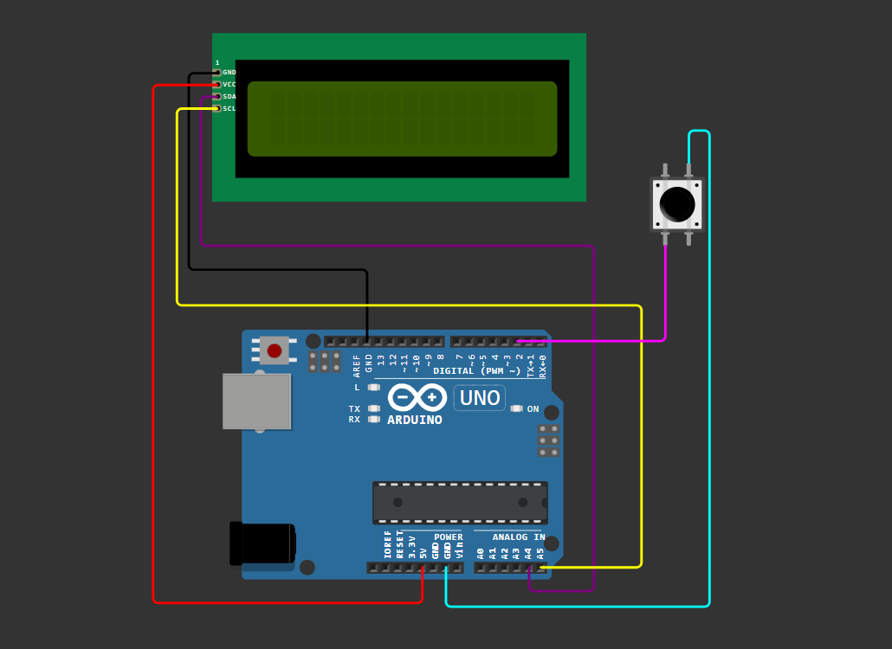

# Arduino LCD Dino Game🦖:
This project involves building a simplified version of the Chrome Dino game on a 16×2 LCD display powered by an Arduino Uno. 
In this game, the player controls a dinosaur that jumps over oncoming obstacles, represented by cacti. The player earns points for each successful jump over these obstacles.
# Components Used:
1) Arduino Uno
2) 16×2 character LCD (HD44780-compatible)
3) Push button
4) Breadboard and jumper wires
# Wiring:
 VCC → 5V, GND → GND, SDA → A4, SCL → A5, Button → Digital pin 2 & GND

  

